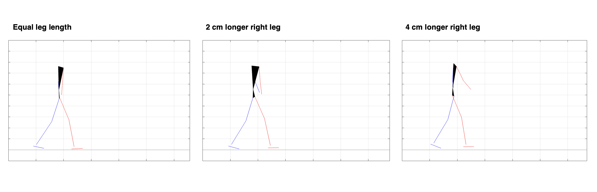
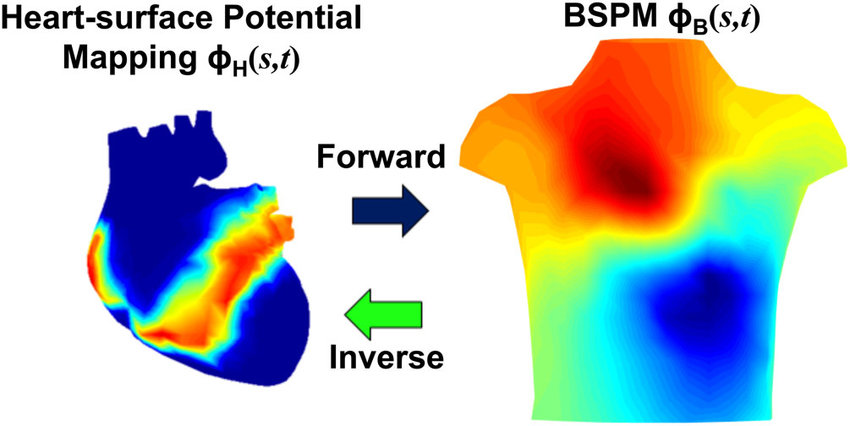

## My Projects

Here are some of the key projects I have worked on, spanning **machine learning, biomedical signal processing, biomechanics and wearable devices**. This page is still under construction.

---

### Deep Learning From Scratch
{: width="450px"}

<small>Source: [freeCodeCamp](https://www.freecodecamp.org/news/want-to-know-how-deep-learning-works-heres-a-quick-guide-for-everyone-1aedeca88076/)</small>

**Location:** FAU Erlangen-Nürnberg

**Description:** I developed a deep learning project from scratch, using no skeletons and no LLM's, as a part of the Deep Learning course given by Prof. Andreas Maier at FAU Erlangen-Nürnberg.
- Basic neural network layers, optimization techniques, and regularization methods are defined.
- These are used implement basic neural network architectures to do classification.
- The project is fully documented with Google-style docstring.

[GitHub Repo](https://github.com/egeozkoc/DeepLearning){:target="_blank"}

---

### Predictive Gait Simulations of Leg Length Inequality

**Location:** FAU Erlangen-Nürnberg, Machine Learning and Data Analytics Lab

- I have completed research internship at Machine Learning and Data Analytics Lab at FAU Erlangen-Nürnberg on biomechanics.
- I investigated the effect of the leg length inequality on the biomechanical dynamics of human movement by running predictive gait simulations on MATLAB.

[Internship Report](../assets/docs/PredictiveGaitSimulationsofLegLengthInequalityReport.pdf){:target="_blank"}

---

### Real-Time Parkinson's Tremor Detection Using Embedded AI
**Location:** Fraunhofer IIS, Medical Sensors and Analytics Group

**Description:** Worked on a hand stabilizer glove project that can mitigate Parkinson’s disease tremors as they start, that could improve the quality of life for Parkinson's patients.
- Trained and evaluated various algorithms from traditional Fourier transform-based algorithms to deep learning algorithms to detect Parkinson's tremors in real time.
- Selected algorithms are implemented on an embedded device through optimizations such as post-training quantization and pruning.
- Master's Thesis: Evaluation of Traditional and Machine Learning Algorithms for Real-time Parkinson's Tremor Detection

[Master's Thesis](../assets/docs/Master_s_Thesis_Ege_Ozkoc.pdf){:target="_blank"}

---

### Inverse Problem of Electrocardiography

{: width="300px"}

<small>Source: [ResearchGate](https://www.researchgate.net/figure/The-illustration-of-forward-and-inverse-ECG-problems_fig2_344270543)</small>

**Location:** Middle East Technical University, Heart Research Laboratory

**Description:** The inverse problem of electrocardiography (ECG) is the problem of reconstructing electrical activity on the heart’s surface (epicardium) or even within the myocardium using body-surface potential measurements obtained from electrodes placed on the torso.

- Worked on the "ClinECGI" project, evaluating the performance of noninvasive electrocardiographic imaging for localizing premature ventricular contractions.
- Applied registration and interpolation methods to transfer epicardial data between geometries in MATLAB.
- Solved the inverse problem of electrocardiography using Bayesian MAP estimation with simulated epicardial data.
- Explored Bayesian estimation methods for inverse electrocardiographic imaging, focusing on prior model selection and noise reduction techniques.

**Conference Papers:**

[Prior Model Selection in Bayesian MAP Estimation- Based ECG Reconstruction](../assets/docs/Prior_Model_Selection_in_Bayesian_MAP_Estimation-Based_ECG_Reconstruction.pdf){:target="_blank"}

[Bayesian MAP solution of the Inverse ECG problem with Sinus Rhythm Data: Evaluation of Simulated Training Sets (In Turkish)](../assets/docs/Bayesian_MAP_solution_of_the_Inverse_ECG_problem_with_Sinus_Rhythm_Data_Evaluation_of_Simulated_Training_Sets.pdf){:target="_blank"}

---

More projects will be added soon.